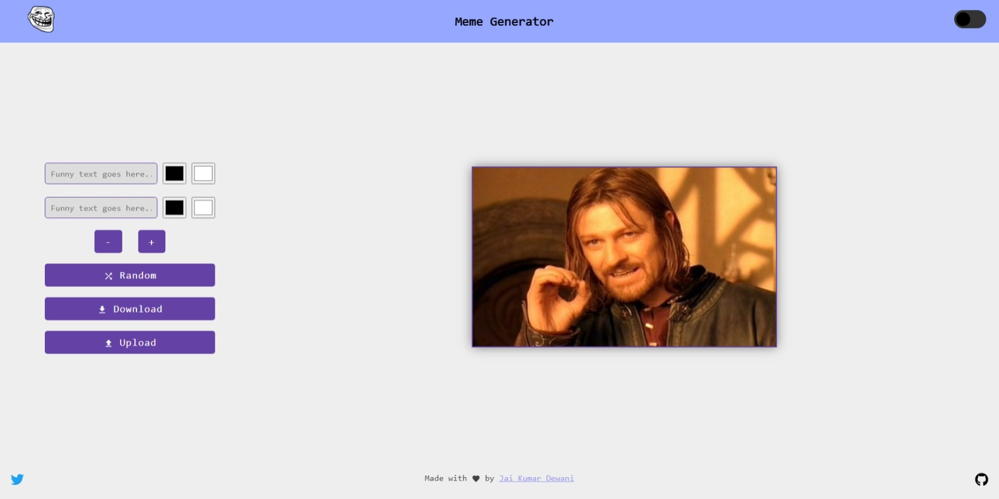
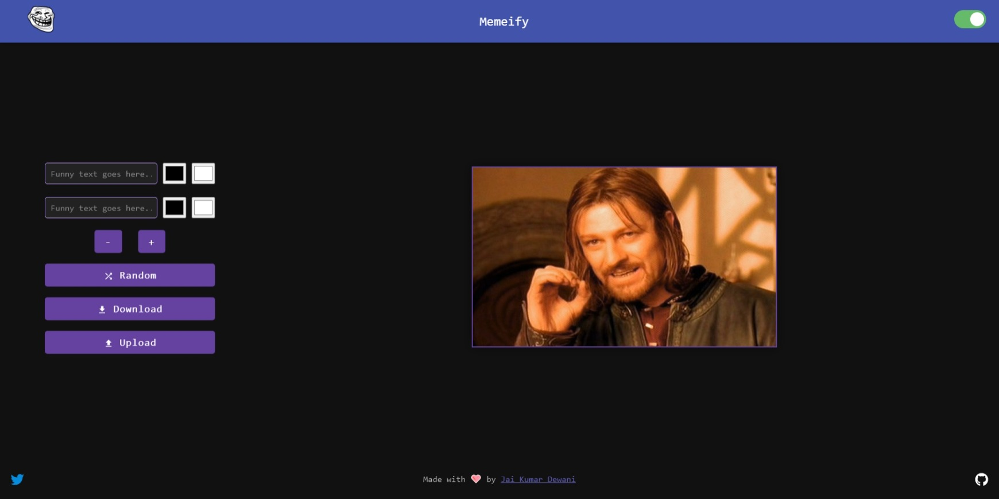

# Memeify

The main idea is to provide a seamless interface for creating memes on web, while I have personally enjoyed creating memes on apps in phones but sometimes you just need a web-app on a big screen. This is the solution to that problem.  

## Want to contribute?
Sure, open an issue, point out errors, and what not. Wanna fix something yourselves, you're welcome to open a PR and I appreciate it.

- Check the [issues](https://github.com/jai-dewani/Meme-App/issues) section for features I am looking to incorporate
- If you have any doubts, feel free to reach out to me on [Twitter](https://twitter.com/jai_dewani)
- Do check the [CONTRIBUTING.md](https://github.com/jai-dewani/Meme-App/blob/master/CONTRIBUTING.md)

**Visit the hosted version [here](https://jai-dewani.github.io/Meme-App/)**

## Screenshot 

Light Mode | Dark Mode 
:------------:|:---------:
 | 

## How to build 

In the project directory, run:  

`npm install`

`npm start`

This runs the app in the development mode.  
Open [http://localhost:3000](http://localhost:3000) to view it in the browser.

